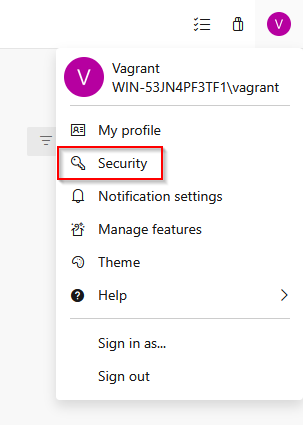

# Toolbox for Azure DevOps

This extension provides convenient access to Microsoft Azure DevOps from within Visual Studio Code and similar code editors. Perform common Azure DevOps tasks without leaving your IDE.

**Note**: This is a third-party project with no affiliation to Microsoft.

## Getting Started

After installing the extension:

1. Click **Add Organization** in any of the Azure DevOps views
2. Enter your server address (defaults to `https://dev.azure.com`)
3. Enter your organization name
4. Enter your personal access token

### Creating a Personal Access Token

In Azure DevOps, click your user icon in the top right corner → **Security** → **Personal access tokens** → **New Token**. Grant appropriate scopes and use the token when adding your organization. Tokens expire and must be renewed.

## Tree Views

The extension provides four views into your Azure DevOps data.

### Work Items

- Work items assigned to you and your teams
- Saved queries, area paths, and work item hierarchy
- Work item details: comments, history, and attachments
- Linked items: commits, pull requests, branches, builds, and related work items
- Edit work items: change state, title, effort, and assignee

### Repositories

- Repository files, commits, branches, and tags
- Pull requests with reviewers, statuses, comments, and linked work items
- Open files in the editor or in the Azure DevOps web portal

### Pipelines

- Pipeline folders, pipelines, and runs
- Run artifacts and timeline records
- Create, rename, and delete folders
- Run, cancel, and re-run pipelines
- Rename and delete pipelines

### Agents

- Agent pools and individual agents
- Jobs running on agents

## Common Actions

Some tree items support:

- **Pin/Unpin**: Keep frequently accessed items at the top of their tree
- **Open in Web**: View items in the Azure DevOps web portal
- **Refresh**: Manually refresh tree data (configurable auto-refresh is also available)

## Configuration

Extension settings (Ctrl+, → Extensions → Azure DevOps Toolbox):

- **Auto-refresh interval**: How often to automatically refresh tree data (in milliseconds)
- **Unwrap accounts**: Show account items directly when only one account exists
- **Unwrap projects**: Show project items directly when only one project exists per account

## Requirements

Tested with:
- Azure DevOps (Cloud)
- Azure DevOps Server Express (Local)

Should also work with:
- Azure DevOps Server (Local)
- Team Foundation Server (TFS)

## Contributing

Report issues or request features on [GitHub](https://github.com/berndfuhrmann/toolbox-azure-devops).

For code contributions, see `DEVELOPMENT.md`.
