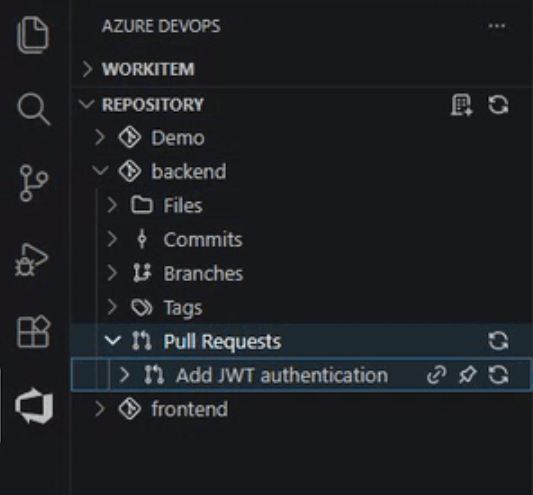

# Toolbox for Azure Devops

This extension provides an intuitive way to access Microsoft Azure Devops from inside of Visual Studio Code and similar code editors. This allows you to do simple tasks in Azure Devops without having to leave VS Code.

Please note that this is a third-party project, I have no affiliation with Microsoft. This is not an official extension.

## Usage

After installing the extension, click `Add Organiztion`. Three text inputs will appear.

1. enter your TFS server address or use the default (https://dev.azure.com)
2. enter your organization name
3. enter your personal access token

If you don't have a personal access token yet, you can create one in Azure Devops:
Login to Azure Devops and click your user icon in the top right corner. Then click "Security" and create a new token.
Use that token when adding the organization. You will need to provide a new token, once the old one expires.

## Features

### General properties

- Multiple accounts and projects per account are supported.
- Some items can be pinned to keep them visible in the tree view.
- Some items can be directly opened in the browser.
- Items will be automatically refreshed after a configurable interval or when manually triggered.

Currently four views are supported:

### Work Items

- View items currently assigned to you and your team(s).
- View queries, area paths and work item hierarchy

### Repositories

- View repositories, including files, commits, tags and pull requests

### Pipelines

- View pipeline folders, pipelines, run and build logs
- Create, rename and delete folders
- Run/Cancel pipeline

### Agents

- View Agent pools and agents
- View jobs running on agents

Authentication to Azure Devops Server (Cloud or On-Premise) is done via Personal Access Token.

# Example

## Requirements

This extension was tested with:

- Azure Devops (Cloud)
- Azure Devops Server Express (Local)

It should also work with:

- Azure Devops Server (Local)

## Extension Settings

- `toolbox-azure-devops-by-bf.autoRefreshInterval`: Interval in milliseconds, specifying refresh cadence. After this time has passed, information will be refetched.
- `toolbox-azure-devops-by-bf.unwrapAccounts`: When you have only one account, you can set this to true to unwrap all items in that account and display them as root items.
- `toolbox-azure-devops-by-bf.unwrapProjects`: When you have only one project, you can set this to true to unwrap all items in that project and display them as account items or maybe root items (see previous setting).

## Contributing

When you encounter an issue or have a feature request, please open an issue on GitHub.

If you want to contribute code, please see `DEVELOPMENT.md`.

## Known Issues

None at the moment.

## Release Notes

### 0.0.4

Initial release to the public. Features views for work items, repositories, pipelines and agents.
